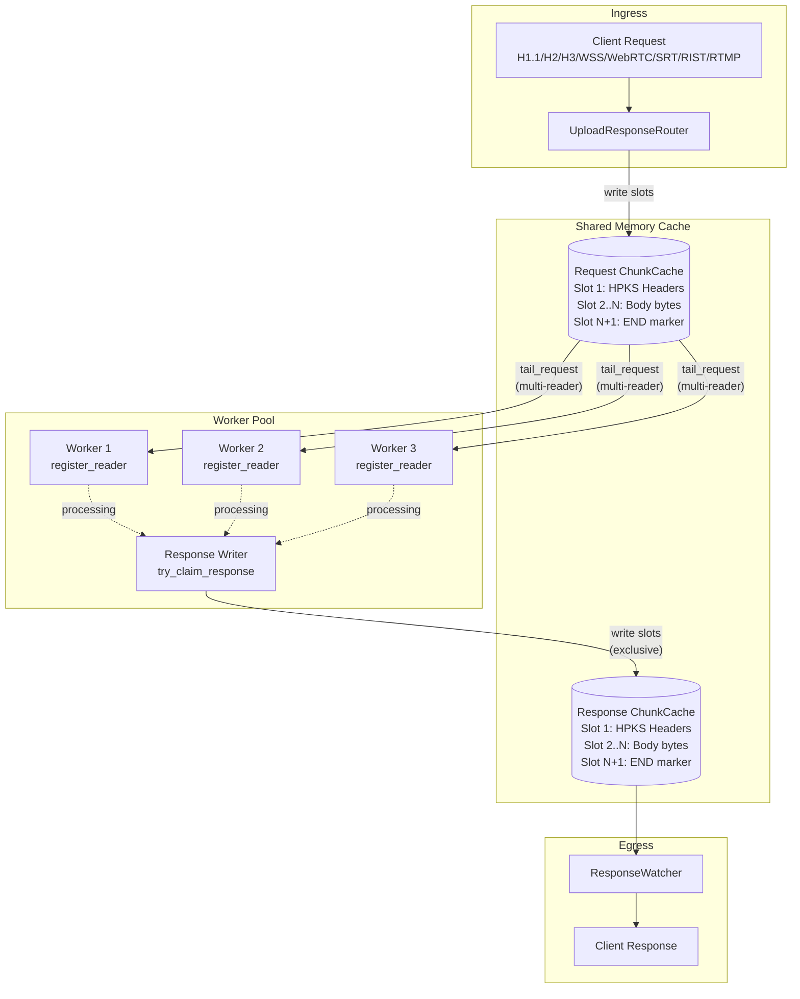

# web-services

`web-services` is the Rust workspace for Wavey's transport, proxy, and low-latency delivery services. It combines a reusable multi-protocol server foundation with cache-backed streaming crates and the `upload-response` request/response pipeline.

## Workspace Overview

| Crate | Purpose |
| --- | --- |
| [`web-service`](./web-service/) | Core HTTP/1.1, HTTP/2, HTTP/3, WebSocket, WebTransport, QUIC relay, raw TCP/TLS server, and proxy primitives. |
| [`upload-response`](./upload-response/) | Shared-memory request/response proxy that streams uploads into a cache, lets workers process them, and returns responses to clients. |
| [`hls`](./hls/) | HLS-specific routing and cache-backed manifest/segment delivery. |
| [`chunks`](./chunks/) | Simple chunk/part delivery routes backed by the shared cache layer. |

## Repository Layout

| Path | Notes |
| --- | --- |
| [`upload-response/tests`](./upload-response/tests/) | Worker integration tests and protocol throughput benchmarks. |
| [`web-service/tests`](./web-service/tests/) | Server and proxy benchmarks. |
| [`tls`](./tls/) | Local TLS material used by tests and local development. |
| [`pem_to_env.sh`](./pem_to_env.sh) | Helper script for exporting PEM files into environment variables. |

## External Dependencies

The workspace still depends on several Wavey Git repositories outside crates.io, but Cargo fetches them directly over HTTPS. On a fresh machine, the first build may need network access for repositories such as:

- `https://github.com/wavey-ai/playlists.git`
- `https://github.com/wavey-ai/http-pack.git`
- `https://github.com/wavey-ai/rist-rs.git`
- `https://github.com/wavey-ai/rtmp-ingress.git`

## Common Commands

```bash
# Build everything
cargo build --workspace

# Run the full workspace test suite
cargo test --workspace

# Run the web-service benchmark harness
cargo test -p web-service --release --test benchmark -- --benchmark

# Run upload-response tests and print benchmark output
cargo test -p upload-response --release -- --nocapture
```

For local TLS-based tests, the repo also includes certificates under [`tls/local.wavey.ai`](./tls/local.wavey.ai/).

## upload-response

The detailed `upload-response` crate documentation now lives here instead of in [`upload-response/README.md`](./upload-response/README.md).

`upload-response` is a high-performance request/response proxy service that streams requests into a shared-memory cache for external workers to process, then returns responses back to clients.

The shared-memory `ChunkCache` and slot-based streaming architecture are inspired by Low-Latency HLS partial segment delivery patterns.

### Supported Protocols

| Protocol | Transport | Encryption | Auth | Notes |
| --- | --- | --- | --- | --- |
| TCP | TCP | TLS | mTLS | Raw bytes, minimal overhead |
| HTTP/1.1 | TCP | TLS | Bearer | Content-Length or chunked |
| HTTP/2 | TCP | TLS | Bearer | Multiplexed streams |
| HTTP/3 | UDP | QUIC | Bearer | Low latency |
| WebSocket | TCP | TLS | Bearer | Binary frames |
| WebRTC | UDP | DTLS | Signaling | Data channels, P2P capable |
| SRT | UDP | AES-128 | Stream ID | Reliable UDP, media ingest |
| RIST | UDP | DTLS/PSK | URL params | Reliable UDP, broadcast ingest |
| RTMP | TCP | None | Stream key | Plain TCP, media ingest |
| RTMPS | TCP | TLS | Stream key | TLS-wrapped RTMP |
| UDP+FEC | UDP | None | None | RaptorQ FEC, lowest-latency reliable delivery |

Some protocols require optional crate features such as `srt`, `rist`, `webrtc`, or `udp-fec`. The default feature set only enables `tcp`.

### Architecture



### Worker Coordination

- Multiple readers can register on the same stream via `register_reader(stream_id, worker_id)`.
- Only one worker can claim response write access via `try_claim_response(stream_id, worker_id)`.
- Reader presence checks are fast because `has_readers()` is backed by atomic counters.

### Stream Format

Each request and response stream uses a simple slot-based format:

| Slot | Content |
| --- | --- |
| 1 | HPKS headers frame with method, path, and headers |
| 2..N-1 | Raw body bytes with no framing overhead |
| N | Empty slot end marker |

- `HPKS` is the `http-pack` streaming format for headers.
- Body slots are raw bytes and can be read zero-copy from the cache.
- An empty slot signals stream completion.

### UDP+FEC Payload Format

UDP+FEC, enabled by the `udp-fec` feature, uses [RaptorQ](https://www.rfc-editor.org/rfc/rfc6330) forward error correction over plain UDP. Each datagram carries a 12-byte wire header followed by a serialized RaptorQ `EncodingPacket`.

```text
0               4               8              12
+---------------+---------------+---------------+
|   block_id    |transfer_length|src_syms|sym_sz|  header (12 bytes)
+---------------+---------------+---------------+
|       EncodingPacket bytes ...               |  variable
```

| Field | Size | Description |
| --- | --- | --- |
| `block_id` | `u32` LE | Monotonically increasing block counter |
| `transfer_length` | `u32` LE | Total source bytes in this block |
| `src_syms` | `u16` LE | `K`, source symbols per block |
| `sym_sz` | `u16` LE | `T`, symbol size in bytes, default `1316` |

Defaults: `K=4`, `T=1316`, `R=1` repair symbol. That recovers any single datagram loss per block with about `80 ms` latency overhead at `48 kHz` and `960`-sample frames.

```rust
use upload_response::{UdpFecIngest, UdpFecSender};

// Sender
let mut sender = UdpFecSender::new(target_addr).await?;
sender.send(&audio_frame).await?;

// Receiver (ingest server)
let ingest = UdpFecIngest::new(service.clone());
let shutdown_tx = ingest.start(bind_addr).await?;
```

### RTMP Payload Format

RTMP streams serialize access units, parsed video or audio frames, to the cache:

```text
[stream_type:1][key:1][id:8][dts:8][pts:8][data_len:4][data:N]
```

| Field | Size | Description |
| --- | --- | --- |
| `stream_type` | 1 byte | `0x1b` for H.264 video, `0x0f` for AAC audio |
| `key` | 1 byte | `1` for keyframe, `0` for non-key |
| `id` | 8 bytes | Sequential frame counter, big-endian |
| `dts` | 8 bytes | Decode timestamp, big-endian |
| `pts` | 8 bytes | Presentation timestamp, big-endian |
| `data_len` | 4 bytes | Payload length, big-endian |
| `data` | N bytes | Video uses Annex-B NALUs, audio uses AAC plus ADTS |

Use `rtmp-ingress` with the `upload-response` feature:

```rust
use rtmp_ingress::upload::{deserialize_access_unit, RtmpUploadIngest};

let rtmp = RtmpUploadIngest::new(service.clone());
rtmp.start(addr).await?;

// Workers deserialize AccessUnits from body slots
let (au, bytes_consumed) = deserialize_access_unit(&data)?;
```

### SRT Payload Format

SRT streams write raw bytes directly to the cache with no additional framing. Workers receive the exact bytes sent by the SRT client.

### Configuration

```rust
use upload_response::{UploadResponseConfig, UploadResponseService};

let config = UploadResponseConfig {
    num_streams: 100,
    slot_size_kb: 64,
    slots_per_stream: 16384,
    response_timeout_ms: 30000,
};

let service = UploadResponseService::new(config);
```

### Slot Size Selection

| Slot Size | Throughput | Use Case |
| --- | --- | --- |
| 16 KB | ~1400 MB/s | Many small requests |
| 64 KB | ~1390 MB/s | Default, good balance |
| 128-512 KB | ~1410-1430 MB/s | Large uploads |
| 1+ MB | ~1300 MB/s | Slight performance drop |

`64 KB` is the default because it keeps slot counts manageable while still delivering strong throughput.

### Worker Integration

Workers consume requests by tailing the request cache and writing a response once they reach the end marker:

```rust
use upload_response::{TailSlot, UploadResponseService};

async fn process_requests(service: Arc<UploadResponseService>, stream_id: u64) {
    let mut slot_id = 0;

    loop {
        let current = service.request_last(stream_id).unwrap_or(0);
        if current <= slot_id {
            tokio::time::sleep(Duration::from_micros(100)).await;
            continue;
        }

        slot_id += 1;

        match service.tail_request(stream_id, slot_id).await {
            Some(TailSlot::Headers(h)) => {
                // h.method, h.path, h.headers
            }
            Some(TailSlot::Body(data)) => {
                // Process body chunk (zero-copy Bytes)
            }
            Some(TailSlot::End) => {
                write_response(service, stream_id, result).await;
                break;
            }
            None => {}
        }
    }
}

async fn write_response(
    service: Arc<UploadResponseService>,
    stream_id: u64,
    body: Bytes,
) {
    let headers = StreamHeaders::Response(StreamResponseHeaders {
        stream_id,
        version: HttpVersion::Http11,
        status: 200,
        headers: vec![],
    });

    service.write_response_headers(stream_id, headers).await.unwrap();
    service.append_response_body(stream_id, body).await.unwrap();
    service.end_response(stream_id).await.unwrap();
}
```

### Performance

Benchmarks below were captured on Apple Silicon in release mode.

#### Slot Size Throughput

```text
=== Slot Size Throughput Benchmark ===
Upload size: 512 MB
   Slot Size |   Throughput |   Slots Used
-------------+--------------+-------------
        16 KB |    1397 MB/s |        32768
        32 KB |    1374 MB/s |        16384
        64 KB |    1390 MB/s |         8192
       100 KB |    1424 MB/s |         5242
       128 KB |    1412 MB/s |         4096
       256 KB |    1411 MB/s |         2048
       512 KB |    1430 MB/s |         1024
       768 KB |    1418 MB/s |          682
      1024 KB |    1322 MB/s |          512
      2048 KB |    1307 MB/s |          256
```

#### Protocol Latency

Latency characteristics for streaming and real-time delivery, such as audio frames. This ranking is effectively the inverse of the bulk throughput table.

| Protocol | Latency Source | Worst-case one-way latency |
| --- | --- | --- |
| UDP+FEC | FEC block fill time only, no retransmit | ~20-80 ms, tunable via `K` |
| Raw UDP | Single network hop | ~1 ms, no loss recovery |
| WebRTC | DTLS, SCTP, and NACK retransmit | ~50-150 ms |
| SRT | ARQ retransmit on loss adds at least one RTT | ~120-200 ms |
| RIST | Same retransmit model as SRT | ~100-200 ms |
| TCP/TLS | Head-of-line blocking and Nagle effects | Unpredictable |
| HTTP/1.1 | TCP HOL plus framing overhead | Worse than TCP |
| HTTP/2 | Multiplexing plus HOL at the TCP layer | Worse than TCP |
| HTTP/3 | QUIC avoids per-stream HOL, but adds crypto RTT | ~50-100 ms |

SRT and RIST trade latency for reliability via retransmission. A lost packet always costs at least one additional RTT. UDP+FEC pays the latency cost up front and deterministically, so worst-case latency is fixed at block-fill time regardless of packet loss.

For small audio frames at `48 kHz` and `960` samples, about `20 ms` per frame, `K=1` yields a fixed `~20 ms` overhead with single-packet loss recovery when `R=1`:

```rust
let sender = UdpFecSender::new(target)
    .await?
    .with_source_symbols(1)
    .with_repair_symbols(1);
```

#### Protocol Throughput

Benchmarked on Apple Silicon, `--release`, `512 MB` upload:

| Protocol | Throughput | Notes |
| --- | --- | --- |
| WebSocket | 1244 MB/s | Binary frames |
| HTTP/1.1 (chunked) | 1053 MB/s | Streaming without `Content-Length` |
| HTTP/2 | 798 MB/s | Multiplexed streams |
| RTMP | 604 MB/s | Plain TCP, access-unit serialization |
| WebRTC | 580 MB/s | DTLS, SCTP data channels |
| HTTP/1.1 | 551 MB/s | Requires `Content-Length` |
| HTTP/3 | 199 MB/s | QUIC encryption overhead |
| SRT | 125 MB/s | AES-128, reliable UDP with ARQ |
| RIST | 105 MB/s | Main profile, reliable UDP |
| UDP+FEC | 49 MB/s | RaptorQ encode/decode bound, fixed-latency reliable delivery |

HTTP and WebSocket figures measure end-to-end request/response time. SRT, RTMP, WebRTC, and UDP+FEC figures measure client send completion.

#### UDP+FEC Throughput

UDP+FEC is optimized for latency, not bulk transfer. The RaptorQ codec dominates at high data rates, but for audio-sized frames on a `~20 ms` cadence the encode overhead is negligible.

```text
========================================
    UDP+FEC (RaptorQ) Benchmark  (--release, loopback)
========================================
UDP+FEC 100 MB:          49.2 MB/s
UDP+FEC loss-recovery:   23.8 MB/s   (20% packet loss, 2 repair symbols)
========================================
```

Tune `K` and `R` to balance latency versus redundancy:

| K (src syms) | R (repair) | Block latency at 48 kHz/960 | Recovers |
| --- | --- | --- | --- |
| 4 | 1 | ~80 ms | Any 1 loss per 5 packets |
| 2 | 1 | ~40 ms | Any 1 loss per 3 packets |
| 1 | 1 | ~20 ms | Any 1 loss per 2 packets |

#### High-Throughput Modes

Both SRT and WebRTC expose high-throughput modes for bulk transfer:

```rust
// SRT high-throughput mode (adds SendBuffer, zero PeerLatency)
let srt = SrtIngest::new(service);
srt.start_high_throughput(addr).await?;

// WebRTC high-throughput mode (larger SCTP messages, increased MTU)
let (socket, loop_fut) = WebRtcSocketBuilder::new(&url)
    .add_channel(ChannelConfig::reliable())
    .high_throughput()
    .build();
```

Those modes trade latency for better sustained transfer rates.

#### Cache Throughput

Single-stream sequential writes:

```text
Upload size: 1024 MB
Slot size: 64 KB
Throughput: ~1390 MB/s
```

Concurrent multi-stream, `8` streams with `1` writer and `2` readers each:

```text
Write:  1864 MB/s (29,827 ops/s)
Read:   3966 MB/s (63,461 ops/s)
Combined: 5830 MB/s
```

Massive concurrent reads, `1000` readers with `1` writer:

```text
Read:  22.1M ops/s
Write: 22K ops/s (concurrent with reads)
```

The `ChunkCache` scales to very high read fan-out because it uses:

- Pre-allocated ring buffers with no per-write allocation
- Per-slot `RwLock` instead of a global lock
- Lock-free `last()` checks via atomics
- Zero-copy reads through `Bytes::slice()`
- Only 12 bytes of overhead per slot, 4-byte length plus 8-byte xxhash

### Testing

```bash
# Run all upload-response tests
cargo test -p upload-response

# Run all protocol benchmarks and print output
cargo test -p upload-response --release -- --nocapture

# Specific worker/cache benchmarks
cargo test -p upload-response --release test_slot_size_benchmark -- --nocapture
cargo test -p upload-response --release test_gigabyte_upload_benchmark -- --nocapture

# Protocol comparison benchmark
cargo test -p upload-response --release test_protocol_comparison -- --nocapture

# UDP+FEC benchmark
cargo test -p upload-response --release --features "srt,rist,webrtc,tcp,udp-fec" test_udp_fec_benchmark -- --nocapture
```

### Dependencies

- `web-service` provides server traits such as `Router` and `StreamWriter`.
- `playlists` provides the shared-memory `ChunkCache`.
- `http-pack` provides the HPKS framing used for headers.
- `raptorq` is optional and only needed for `udp-fec`.
