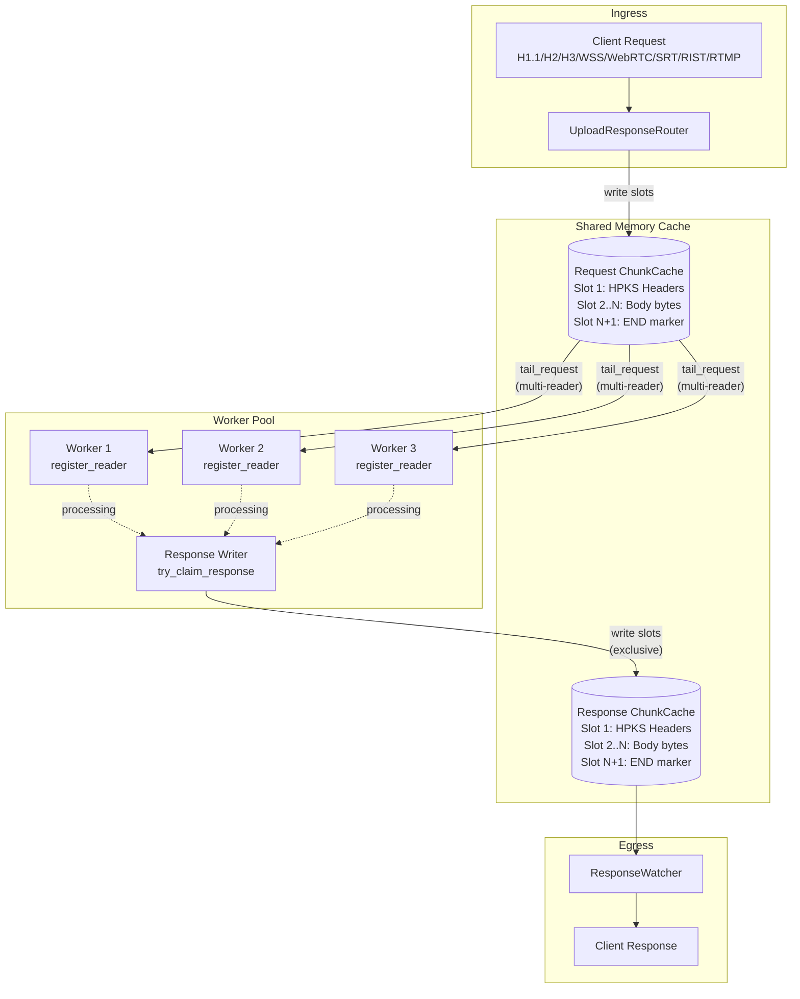

# upload-response

A high-performance request/response proxy service that streams requests into a shared-memory cache for external workers to process, then returns responses back to clients.

The shared-memory ChunkCache and slot-based streaming architecture are inspired by Low-Latency HLS (LL-HLS) partial segment delivery patterns.

## Supported Protocols

| Protocol | Transport | Encryption | Auth | Notes |
|----------|-----------|------------|------|-------|
| TCP | TCP | TLS | mTLS | Raw bytes, minimal overhead |
| HTTP/1.1 | TCP | TLS | Bearer | Content-Length or chunked |
| HTTP/2 | TCP | TLS | Bearer | Multiplexed streams |
| HTTP/3 | UDP | QUIC | Bearer | Low latency |
| WebSocket | TCP | TLS | Bearer | Binary frames |
| WebRTC | UDP | DTLS | Signaling | Data channels, P2P capable |
| SRT | UDP | AES-128 | Stream ID | Reliable UDP, media ingest |
| RIST | UDP | DTLS/PSK | URL params | Reliable UDP, broadcast ingest |
| RTMP | TCP | None | Stream key | Plain TCP, media ingest |
| RTMPS | TCP | TLS | Stream key | TLS-wrapped RTMP |
| UDP+FEC | UDP | None | None | RaptorQ FEC, lowest-latency reliable delivery |

## Architecture


```mermaid
flowchart TB
    subgraph Ingress
        Client[Client Request<br/>H1.1/H2/H3/WSS/WebRTC/SRT/RIST/RTMP]
        Router[UploadResponseRouter]
    end

    subgraph Cache["Shared Memory Cache"]
        ReqCache[(Request ChunkCache<br/>Slot 1: HPKS Headers<br/>Slot 2..N: Body bytes<br/>Slot N+1: END marker)]
        RespCache[(Response ChunkCache<br/>Slot 1: HPKS Headers<br/>Slot 2..N: Body bytes<br/>Slot N+1: END marker)]
    end

    subgraph Workers["Worker Pool"]
        W1[Worker 1<br/>register_reader]
        W2[Worker 2<br/>register_reader]
        W3[Worker 3<br/>register_reader]
        Writer[Response Writer<br/>try_claim_response]
    end

    subgraph Egress
        Watcher[ResponseWatcher]
        Response[Client Response]
    end

    Client --> Router
    Router -->|"write slots"| ReqCache
    ReqCache -->|"tail_request<br/>(multi-reader)"| W1
    ReqCache -->|"tail_request<br/>(multi-reader)"| W2
    ReqCache -->|"tail_request<br/>(multi-reader)"| W3
    W1 -.->|"processing"| Writer
    W2 -.->|"processing"| Writer
    W3 -.->|"processing"| Writer
    Writer -->|"write slots<br/>(exclusive)"| RespCache
    RespCache --> Watcher
    Watcher --> Response
```

### Worker Coordination

- **Multiple Readers**: Any number of workers can register as readers via `register_reader(stream_id, worker_id)`
- **Single Writer**: Only one worker can claim response write access via `try_claim_response(stream_id, worker_id)`
- **Lock-free Reads**: Reader count is tracked with atomic counters for fast `has_readers()` checks

## Stream Format

Each request/response stream uses a simple slot-based format:

| Slot | Content |
|------|---------|
| 1 | HPKS Headers frame (method, path, headers) |
| 2..N-1 | Raw body bytes (no framing overhead) |
| N | Empty slot (end marker) |

- **HPKS**: HTTP-pack streaming format for headers
- **Body slots**: Raw bytes, zero-copy from cache
- **End marker**: Empty slot signals stream completion

### UDP+FEC Payload Format

UDP+FEC (feature `udp-fec`) uses [RaptorQ](https://www.rfc-editor.org/rfc/rfc6330) forward error correction over plain UDP. Each datagram carries a 12-byte wire header followed by a serialised RaptorQ `EncodingPacket`:

```
0               4               8              12
├───────────────┼───────────────┼───────────────┤
│   block_id    │transfer_length│src_syms│sym_sz │  header (12 bytes)
└───────────────┴───────────────┴───────────────┘
│          EncodingPacket bytes …               │  variable
```

| Field | Size | Description |
|-------|------|-------------|
| `block_id` | u32 LE | Monotonically increasing block counter |
| `transfer_length` | u32 LE | Total source bytes in this block |
| `src_syms` | u16 LE | K — source symbols per block |
| `sym_sz` | u16 LE | T — symbol size in bytes (default 1316) |

Defaults: K=4, T=1316, R=1 repair symbol → recovers any single datagram loss per block with ~80 ms latency overhead at 48 kHz/960-sample frames.

```rust
use upload_response::{UdpFecIngest, UdpFecSender};

// Sender
let mut sender = UdpFecSender::new(target_addr).await?;
sender.send(&audio_frame).await?;

// Receiver (ingest server)
let ingest = UdpFecIngest::new(service.clone());
let shutdown_tx = ingest.start(bind_addr).await?;
```

### RTMP Payload Format

RTMP streams serialize **AccessUnits** (parsed video/audio frames) to the cache:

```
[stream_type:1][key:1][id:8][dts:8][pts:8][data_len:4][data:N]
```

| Field | Size | Description |
|-------|------|-------------|
| `stream_type` | 1 byte | `0x1b` = H.264 video, `0x0f` = AAC audio |
| `key` | 1 byte | `1` = keyframe, `0` = non-key |
| `id` | 8 bytes | Sequential frame counter (big-endian) |
| `dts` | 8 bytes | Decode timestamp (big-endian) |
| `pts` | 8 bytes | Presentation timestamp (big-endian) |
| `data_len` | 4 bytes | Payload length (big-endian) |
| `data` | N bytes | Video: Annex-B NALUs, Audio: AAC+ADTS |

Use `rtmp-ingress` with the `upload-response` feature:

```rust
use rtmp_ingress::upload::{RtmpUploadIngest, deserialize_access_unit};

let rtmp = RtmpUploadIngest::new(service.clone());
rtmp.start(addr).await?;

// Workers deserialize AccessUnits from body slots
let (au, bytes_consumed) = deserialize_access_unit(&data)?;
```

### SRT Payload Format

SRT streams write raw bytes directly to the cache (no framing). Workers receive the exact bytes sent by the SRT client.

## Configuration

```rust
use upload_response::{UploadResponseConfig, UploadResponseService};

let config = UploadResponseConfig {
    num_streams: 100,         // Max concurrent requests
    slot_size_kb: 64,         // 64KB per slot (default)
    slots_per_stream: 16384,  // ~1GB max per request
    response_timeout_ms: 30000,
};

let service = UploadResponseService::new(config);
```

### Slot Size Selection

| Slot Size | Throughput | Use Case |
|-----------|------------|----------|
| 16 KB | ~1400 MB/s | Many small requests |
| 64 KB | ~1390 MB/s | **Default** - good balance |
| 128-512 KB | ~1410-1430 MB/s | Large uploads |
| 1+ MB | ~1300 MB/s | Slight performance drop |

64KB is the default as it provides excellent throughput while keeping slot count reasonable for large uploads.

## Worker Integration

Workers consume requests by tailing the request cache:

```rust
use upload_response::{TailSlot, UploadResponseService};

async fn process_requests(service: Arc<UploadResponseService>, stream_id: u64) {
    let mut slot_id = 0;

    loop {
        // Wait for new slot
        let current = service.request_last(stream_id).unwrap_or(0);
        if current <= slot_id {
            tokio::time::sleep(Duration::from_micros(100)).await;
            continue;
        }

        slot_id += 1;

        match service.tail_request(stream_id, slot_id).await {
            Some(TailSlot::Headers(h)) => {
                // h.method, h.path, h.headers
            }
            Some(TailSlot::Body(data)) => {
                // Process body chunk (zero-copy Bytes)
            }
            Some(TailSlot::End) => {
                // Request complete, write response
                write_response(service, stream_id, result).await;
                break;
            }
            None => {}
        }
    }
}

async fn write_response(
    service: Arc<UploadResponseService>,
    stream_id: u64,
    body: Bytes,
) {
    let headers = StreamHeaders::Response(StreamResponseHeaders {
        stream_id,
        version: HttpVersion::Http11,
        status: 200,
        headers: vec![],
    });

    service.write_response_headers(stream_id, headers).await.unwrap();
    service.append_response_body(stream_id, body).await.unwrap();
    service.end_response(stream_id).await.unwrap();
}
```

## Performance

Benchmarked on Apple Silicon (M-series):

```
=== Slot Size Throughput Benchmark ===
Upload size: 512 MB
   Slot Size |   Throughput |   Slots Used
-------------+--------------+-------------
        16 KB |    1397 MB/s |        32768
        32 KB |    1374 MB/s |        16384
        64 KB |    1390 MB/s |         8192
       100 KB |    1424 MB/s |         5242
       128 KB |    1412 MB/s |         4096
       256 KB |    1411 MB/s |         2048
       512 KB |    1430 MB/s |         1024
       768 KB |    1418 MB/s |          682
      1024 KB |    1322 MB/s |          512
      2048 KB |    1307 MB/s |          256
```

### Protocol Latency

Latency characteristics for streaming/real-time delivery (e.g. audio frames). This ranking is essentially the inverse of the throughput table.

| Protocol | Latency Source | Worst-case one-way latency |
|----------|---------------|---------------------------|
| UDP+FEC | FEC block fill time only — no retransmit | **~20–80 ms** (tunable via K) |
| Raw UDP | Single network hop | ~1 ms (no loss recovery) |
| WebRTC | DTLS + SCTP + NACK retransmit | ~50–150 ms |
| SRT | ARQ retransmit on loss adds ≥1 RTT | ~120–200 ms |
| RIST | Same retransmit model as SRT | ~100–200 ms |
| TCP/TLS | Head-of-line blocking, Nagle algorithm | unpredictable |
| HTTP/1.1 | TCP HOL + framing overhead | worse than TCP |
| HTTP/2 | Stream multiplexing + HOL at TCP layer | worse than TCP |
| HTTP/3 | Per-stream HOL solved, but QUIC adds crypto RTT | ~50–100 ms |

SRT and RIST trade latency for reliability via retransmission — a lost packet always costs at minimum one additional RTT. UDP+FEC pays its latency cost upfront and **deterministically**: worst-case latency is fixed at block-fill time regardless of packet loss, with zero retransmit jitter.

For small audio frames at 48 kHz / 960 samples (~20 ms per frame), setting K=1 gives a fixed ~20 ms overhead with single-packet loss recovery (R=1):

```rust
let sender = UdpFecSender::new(target)
    .await?
    .with_source_symbols(1)   // K=1: one frame per FEC block
    .with_repair_symbols(1);  // R=1: recovers any single datagram loss
```

### Protocol Throughput

Benchmarked on Apple Silicon (M-series), `--release`, 512 MB upload:

| Protocol | Throughput | Notes |
|----------|------------|-------|
| WebSocket | 1244 MB/s | Binary frames |
| HTTP/1.1 (chunked) | 1053 MB/s | Streaming without Content-Length |
| HTTP/2 | 798 MB/s | Multiplexed streams |
| RTMP | 604 MB/s | Plain TCP, AccessUnit serialization |
| WebRTC | 580 MB/s | DTLS, SCTP data channels |
| HTTP/1.1 | 551 MB/s | Requires Content-Length |
| HTTP/3 | 199 MB/s | QUIC encryption overhead |
| SRT | 125 MB/s | AES-128, reliable UDP with ARQ |
| RIST | 105 MB/s | Main profile, reliable UDP |
| UDP+FEC | 49 MB/s | RaptorQ FEC encode/decode bound; fixed-latency reliable delivery |

Note: HTTP/WebSocket protocols measure end-to-end (wait for response). SRT/RTMP/WebRTC/UDP+FEC measure client send completion.

### UDP+FEC Throughput

UDP+FEC is optimised for **latency**, not bulk throughput. The RaptorQ codec dominates at high data rates. For audio use-cases (small frames, ~20 ms cadence) the encode overhead is negligible.

```
========================================
    UDP+FEC (RaptorQ) Benchmark  (--release, loopback)
========================================
UDP+FEC 100 MB:          49.2 MB/s ✓
UDP+FEC loss-recovery:   23.8 MB/s ✓   (20% packet loss, 2 repair symbols)
========================================
```

Tune K and R to balance latency vs redundancy:

| K (src syms) | R (repair) | Block latency @ 48 kHz/960 | Recovers |
|---|---|---|---|
| 4 | 1 | ~80 ms | any 1 loss per 5 packets |
| 2 | 1 | ~40 ms | any 1 loss per 3 packets |
| 1 | 1 | ~20 ms | any 1 loss per 2 packets |

### High-Throughput Modes

Both SRT and WebRTC support high-throughput configuration for bulk transfer:

```rust
// SRT high-throughput mode (adds SendBuffer, zero PeerLatency)
let srt = SrtIngest::new(service);
srt.start_high_throughput(addr).await?;

// WebRTC high-throughput mode (larger SCTP messages, increased MTU)
let (socket, loop_fut) = WebRtcSocketBuilder::new(&url)
    .add_channel(ChannelConfig::reliable())
    .high_throughput()
    .build();
```

These modes optimize for throughput over latency, useful for file transfer scenarios.

### Cache Throughput (In-Memory)

Single-stream sequential writes:
```
Upload size: 1024 MB
Slot size: 64 KB
Throughput: ~1390 MB/s
```

Concurrent multi-stream (8 streams, 1 writer + 2 readers each):
```
Write:  1864 MB/s (29,827 ops/s)
Read:   3966 MB/s (63,461 ops/s)
Combined: 5830 MB/s
```

Massive concurrent reads (1000 readers, 1 writer):
```
Read:  22.1M ops/s
Write: 22K ops/s (concurrent with reads)
```

The ChunkCache scales to millions of concurrent reads due to:

- Pre-allocated ring buffers (no malloc per write)
- Per-slot RwLock (readers only contend on same slot, not globally)
- Lock-free `last()` via atomic load
- Zero-copy reads via `Bytes::slice()`
- 12-byte overhead per slot (4-byte length + 8-byte xxhash)

## Testing

```bash
# Run all tests
cargo test -p upload-response

# Run benchmarks (release mode recommended)
cargo test -p upload-response --release -- --nocapture

# Specific benchmark tests
cargo test -p upload-response --release test_slot_size_benchmark -- --nocapture
cargo test -p upload-response --release test_gigabyte_upload_benchmark -- --nocapture

# UDP+FEC benchmark (requires udp-fec feature; --release for accurate throughput)
cargo test -p upload-response --release --features "srt,rist,webrtc,tcp,udp-fec" test_udp_fec_benchmark -- --nocapture
```

## Dependencies

- `web-service` - HTTP server traits (Router, StreamWriter)
- `playlists` - ChunkCache shared-memory ring buffer
- `http-pack` - HPKS streaming HTTP format
- `raptorq` *(optional, feature `udp-fec`)* - RaptorQ FEC codec
