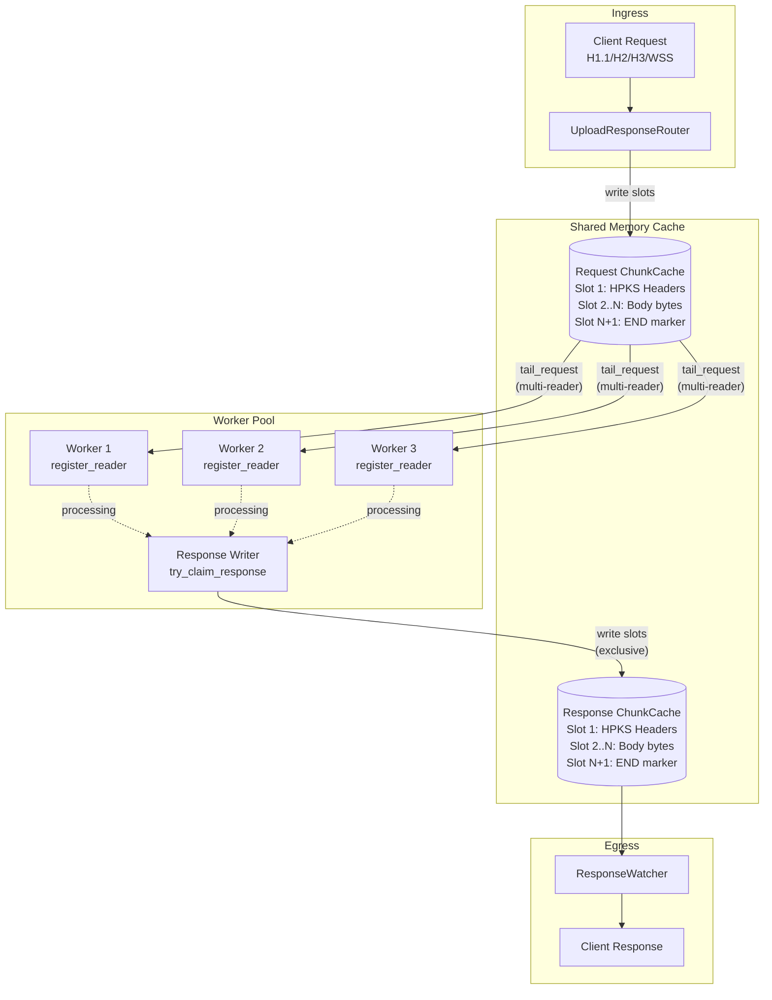

# upload-response

A high-performance request/response proxy service that streams HTTP requests into a shared-memory cache for external workers to process, then returns responses back to clients.

## Architecture



### Worker Coordination

- **Multiple Readers**: Any number of workers can register as readers via `register_reader(stream_id, worker_id)`
- **Single Writer**: Only one worker can claim response write access via `try_claim_response(stream_id, worker_id)`
- **Lock-free Reads**: Reader count is tracked with atomic counters for fast `has_readers()` checks

## Stream Format

Each request/response stream uses a simple slot-based format:

| Slot | Content |
|------|---------|
| 1 | HPKS Headers frame (method, path, headers) |
| 2..N-1 | Raw body bytes (no framing overhead) |
| N | Empty slot (end marker) |

- **HPKS**: HTTP-pack streaming format for headers
- **Body slots**: Raw bytes, zero-copy from cache
- **End marker**: Empty slot signals stream completion

## Configuration

```rust
use upload_response::{UploadResponseConfig, UploadResponseService};

let config = UploadResponseConfig {
    num_streams: 100,         // Max concurrent requests
    slot_size_kb: 64,         // 64KB per slot (default)
    slots_per_stream: 16384,  // ~1GB max per request
    response_timeout_ms: 30000,
};

let service = UploadResponseService::new(config);
```

### Slot Size Selection

| Slot Size | Throughput | Use Case |
|-----------|------------|----------|
| 16 KB | ~1400 MB/s | Many small requests |
| 64 KB | ~1390 MB/s | **Default** - good balance |
| 128-512 KB | ~1410-1430 MB/s | Large uploads |
| 1+ MB | ~1300 MB/s | Slight performance drop |

64KB is the default as it provides excellent throughput while keeping slot count reasonable for large uploads.

## Worker Integration

Workers consume requests by tailing the request cache:

```rust
use upload_response::{TailSlot, UploadResponseService};

async fn process_requests(service: Arc<UploadResponseService>, stream_id: u64) {
    let mut slot_id = 0;

    loop {
        // Wait for new slot
        let current = service.request_last(stream_id).unwrap_or(0);
        if current <= slot_id {
            tokio::time::sleep(Duration::from_micros(100)).await;
            continue;
        }

        slot_id += 1;

        match service.tail_request(stream_id, slot_id).await {
            Some(TailSlot::Headers(h)) => {
                // h.method, h.path, h.headers
            }
            Some(TailSlot::Body(data)) => {
                // Process body chunk (zero-copy Bytes)
            }
            Some(TailSlot::End) => {
                // Request complete, write response
                write_response(service, stream_id, result).await;
                break;
            }
            None => {}
        }
    }
}

async fn write_response(
    service: Arc<UploadResponseService>,
    stream_id: u64,
    body: Bytes,
) {
    let headers = StreamHeaders::Response(StreamResponseHeaders {
        stream_id,
        version: HttpVersion::Http11,
        status: 200,
        headers: vec![],
    });

    service.write_response_headers(stream_id, headers).await.unwrap();
    service.append_response_body(stream_id, body).await.unwrap();
    service.end_response(stream_id).await.unwrap();
}
```

## Performance

Benchmarked on Apple Silicon (M-series):

```
=== Slot Size Throughput Benchmark ===
Upload size: 512 MB
   Slot Size |   Throughput |   Slots Used
-------------+--------------+-------------
        16 KB |    1397 MB/s |        32768
        32 KB |    1374 MB/s |        16384
        64 KB |    1390 MB/s |         8192
       100 KB |    1424 MB/s |         5242
       128 KB |    1412 MB/s |         4096
       256 KB |    1411 MB/s |         2048
       512 KB |    1430 MB/s |         1024
       768 KB |    1418 MB/s |          682
      1024 KB |    1322 MB/s |          512
      2048 KB |    1307 MB/s |          256
```

### Protocol Throughput (1 GB Upload)

End-to-end benchmarks with real HTTP servers (TLS + protocol overhead):

| Protocol | Throughput | Notes |
|----------|------------|-------|
| WSS      | 902 MB/s | WebSocket binary frames |
| HTTP/1.1 (chunked) | 782 MB/s | Transfer-Encoding: chunked |
| HTTP/1.1 | 671 MB/s | Content-Length |
| HTTP/2   | 668 MB/s | Single stream |
| HTTP/3   | 226 MB/s | QUIC/UDP |

### Cache Throughput (In-Memory)

Single-stream sequential writes:
```
Upload size: 1024 MB
Slot size: 64 KB
Throughput: ~1390 MB/s
```

Concurrent multi-stream (8 streams, 1 writer + 2 readers each):
```
Write:  1864 MB/s (29,827 ops/s)
Read:   3966 MB/s (63,461 ops/s)
Combined: 5830 MB/s
```

Massive concurrent reads (1000 readers, 1 writer):
```
Read:  22.1M ops/s
Write: 22K ops/s (concurrent with reads)
```

The ChunkCache scales to millions of concurrent reads due to:

- Pre-allocated ring buffers (no malloc per write)
- Per-slot RwLock (readers only contend on same slot, not globally)
- Lock-free `last()` via atomic load
- Zero-copy reads via `Bytes::slice()`
- 12-byte overhead per slot (4-byte length + 8-byte xxhash)

## Testing

```bash
# Run all tests
cargo test -p upload-response

# Run benchmarks (release mode recommended)
cargo test -p upload-response --release -- --nocapture

# Specific benchmark tests
cargo test -p upload-response --release test_slot_size_benchmark -- --nocapture
cargo test -p upload-response --release test_gigabyte_upload_benchmark -- --nocapture
```

## Dependencies

- `web-service` - HTTP server traits (Router, StreamWriter)
- `playlists` - ChunkCache shared-memory ring buffer
- `http-pack` - HPKS streaming HTTP format
- `tokio` - Async runtime
- `bytes` - Zero-copy byte buffers
